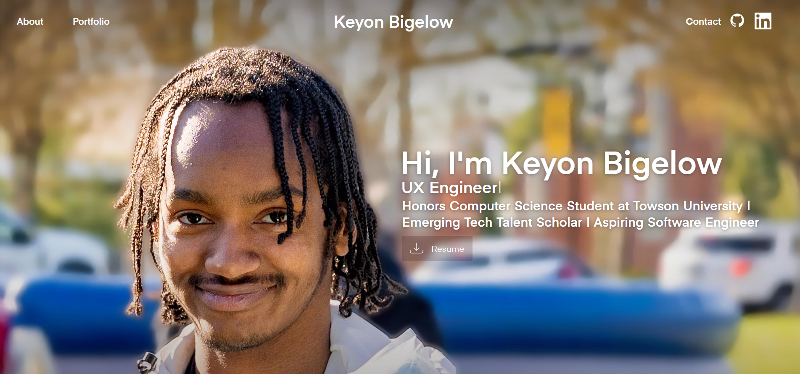
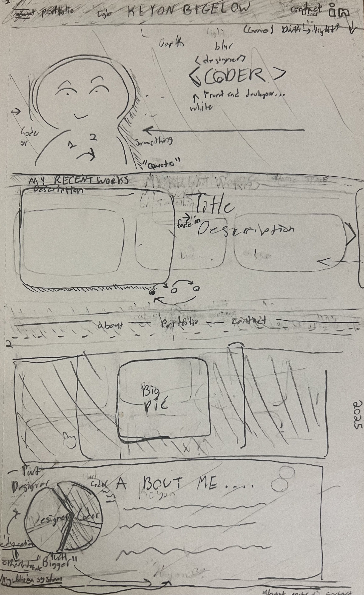
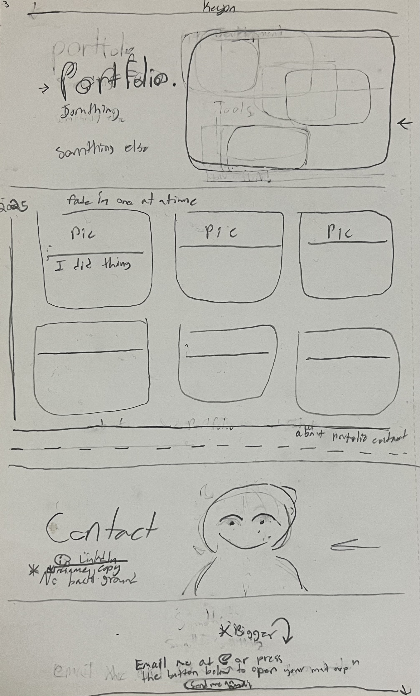

# Keyon Bigelow - UX Engineer Portfolio 👨🏾‍💻

A personal portfolio website designed to showcase my projects, design philosophy, and technical skills. This project highlights my focus on bridging the gap between design (UI/UX) and engineering.

🔗 **Live Demo:** https://low-key-n.github.io/Portfolio/

## 📸 Screenshots


*Desktop View featuring the Hero Section and Tech Stack.*

## 🧠 Design Process

Before building the portfolio, I sketched the layout by hand to plan the information hierarchy, navigation flow, and placement of major sections like the hero, portfolio carousel, and contact area.

These sketches helped guide the visual hierarchy and structure before moving into development.

### Initial Wireframe (Front)

<p align="center">
  
</p>

*Front layout sketch planning the hero section, navigation, and portfolio structure.*

### Layout Planning (Back)

<p align="center">
  
</p>

*Back sketch used to organize content flow and section placement before coding the site.*

## 🚀 Features

* **Responsive Design:** Fully optimized layouts for Desktop, iPad (Landscape & Portrait), and Mobile.
* **Custom Animations:** Typewriter effects and smooth hover states.
* **Interactive Carousel:** A custom-built JavaScript carousel for showcasing projects with touch/swipe support on tablets.
* **Clean Architecture:** Organized file structure separating Assets, CSS, and JS for scalability.

## 🛠️ Tech Stack

* **Frontend:** HTML5, CSS3, JavaScript (ES6+)
* **Design:** Figma
* **Fonts:** Eina (Custom Font integration)

## 📂 Project Structure

```text
KEYON PORTFOLIO WEBSITE/
│
├── assets/          # Images, Fonts, and Documents
├── css/             # Global styles
├── js/              # Carousel logic
├── pages/           # About page
└── index.html       # Main landing page
```

## 📬 Contact
Email: [kbigelo2@students.towson.edu](mailto:kbigelo2@students.towson.edu)

LinkedIn: [Keyon Bigelow](https://www.linkedin.com/in/keyon-bigelow-5568bb364/)

GitHub: [Low-Key-N](https://low-key-n.github.io/Portfolio/)

© 2026 Keyon Bigelow. All Rights Reserved.
